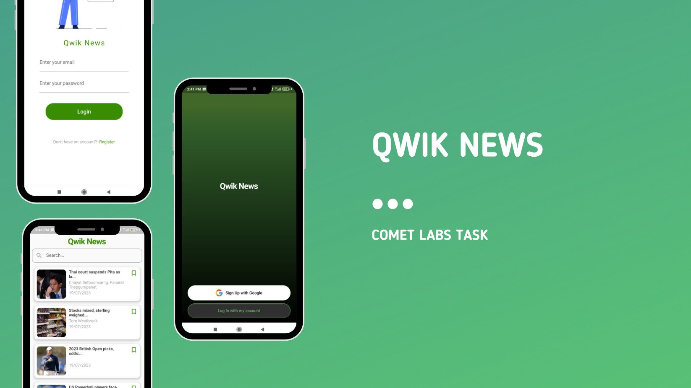

# Qwik News

Stay Informed, Stay Qwik: Your One-Stop Destination for Breaking News

# Features
 - Basic
     - Responsive Design
     - ~~Splash Screen with Fade Effect~~
     - ~~Loading, Refresh, Retry Indicators~~
     - ~~Code Modularisation~~
     - ~~Null Safety and Error Handling~~
 - Advanced
   - Multiple API Keys
   - ~~Backend Service Integration~~ (Firebase)
     - ~~Auth~~
     - Bookmarks
   - ~~Search~~
   - ~~Splash Screen~~
   - ~~Custom UI~~

# Instructions
 - Get your `NEWS_API_KEY` from the website and save it in `lib/Utils/constants.dart`
 - Run `flutter pub get` to acquire dependencies.
 - Run App.
   
[Video Demo](https://youtu.be/S9DIhaAqEJ8)
